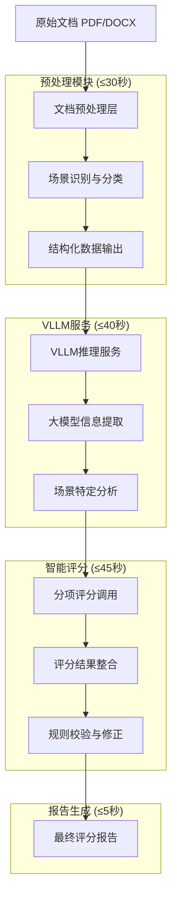
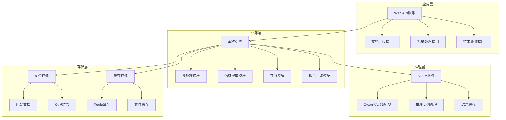

# 基于VLLM+Qwen-VL的智能审核系统技术路线

## 1. 总体技术架构

### 1.1 架构设计理念

**核心理念**: 预处理 + 大模型信息提取 + 大模型智能评分 + 规则后处理

**技术路线**: 充分利用Qwen-VL-7B的多模态理解能力，通过VLLM提供高效推理服务，实现文档的智能理解和精准评分。

### 1.2 整体流程图



## 2. 技术架构详细设计

### 2.1 文档预处理层

**目标**: 将原始文档转换为大模型可理解的标准化格式

**核心组件**:
```python
class DocumentPreprocessor:
    """文档预处理器"""
    
    def __init__(self):
        self.parsers = {
            '.docx': DocxParser(),
            '.pdf': EnhancedPDFParser()
        }
        self.ocr_engine = PaddleOCR(lang='ch')
        self.scene_classifier = SceneClassifier()
    
    def process(self, file_path: str) -> StandardizedDocument:
        """主处理流程"""
        # 1. 基础解析 (≤15秒)
        raw_content = self._parse_document(file_path)
        
        # 2. 场景识别 (≤5秒)
        scene_type = self._classify_scene(raw_content)
        
        # 3. 内容标准化 (≤10秒)
        standardized = self._standardize_content(raw_content, scene_type)
        
        return standardized
```

**输出标准化格式**:
```json
{
  "document_info": {
    "scene_type": "scenario_one|scenario_two",
    "file_name": "文件名",
    "total_pages": 12,
    "processing_timestamp": "2024-01-01T10:00:00Z"
  },
  "text_content": [
    {
      "section_type": "title|content|table_caption",
      "section_name": "职责|作业内容|相关文件",
      "content": "段落文本内容",
      "page_number": 1,
      "hierarchy_level": 2,
      "word_count": 150
    }
  ],
  "tables": [
    {
      "table_id": "table_1",
      "caption": "表格标题",
      "headers": ["列名1", "列名2"],
      "data": [["数据1", "数据2"]],
      "page_number": 2,
      "table_type": "parameter|personnel|procedure"
    }
  ],
  "images": [
    {
      "image_id": "img_1", 
      "type": "route_map|signature_page|schematic|photo",
      "base64_data": "base64编码",
      "extracted_text": "OCR提取的文字",
      "page_number": 3,
      "description": "图片描述"
    }
  ]
}
```

### 2.2 VLLM推理服务层

**部署配置**:
```bash
# 启动VLLM服务
python -m vllm.entrypoints.openai.api_server \
    --model Qwen/Qwen-VL-Chat-7B \
    --served-model-name qwen-vl-7b \
    --host 0.0.0.0 \
    --port 8000 \
    --max-model-len 8192 \
    --tensor-parallel-size 1 \
    --gpu-memory-utilization 0.9 \
    --max-num-seqs 4
```

**客户端封装**:
```python
class VLLMInferenceClient:
    """VLLM推理客户端"""
    
    def __init__(self, base_url="http://localhost:8000/v1"):
        self.client = OpenAI(api_key="EMPTY", base_url=base_url)
        self.model_name = "qwen-vl-7b"
    
    def text_analysis(self, prompt: str, max_tokens: int = 2048) -> str:
        """纯文本分析"""
        response = self.client.chat.completions.create(
            model=self.model_name,
            messages=[{"role": "user", "content": prompt}],
            max_tokens=max_tokens,
            temperature=0.1,
            top_p=0.9
        )
        return response.choices[0].message.content
    
    def multimodal_analysis(self, text_prompt: str, images: List[str]) -> str:
        """多模态分析"""
        content = [{"type": "text", "text": text_prompt}]
        for img_base64 in images:
            content.append({
                "type": "image_url", 
                "image_url": {"url": f"data:image/png;base64,{img_base64}"}
            })
        
        response = self.client.chat.completions.create(
            model=self.model_name,
            messages=[{"role": "user", "content": content}],
            max_tokens=2048,
            temperature=0.1
        )
        return response.choices[0].message.content
```

### 2.3 大模型信息提取层

**设计思路**: 利用大模型的理解能力，从预处理后的文档中提取结构化信息

**核心提取器**:
```python
class LLMInfoExtractor:
    """大模型信息提取器"""
    
    def __init__(self, vllm_client: VLLMInferenceClient):
        self.client = vllm_client
        self.prompts = ExtractionPrompts()
    
    def extract_all_info(self, document: StandardizedDocument) -> ExtractedInfo:
        """完整信息提取流程"""
        extracted = ExtractedInfo()
        
        # 1. 基础元数据提取 (≤8秒)
        extracted.metadata = self._extract_metadata(document)
        
        # 2. 多模态内容理解 (≤20秒)
        extracted.multimodal_analysis = self._analyze_multimodal_content(document)
        
        # 3. 场景特定信息提取 (≤12秒)
        extracted.scenario_specific = self._extract_scenario_specific(document)
        
        return extracted
    
    def _extract_metadata(self, document: StandardizedDocument) -> Dict:
        """基础元数据提取"""
        prompt = self.prompts.get_metadata_prompt(document.get_text_summary())
        response = self.client.text_analysis(prompt)
        return self._parse_json_response(response)
    
    def _analyze_multimodal_content(self, document: StandardizedDocument) -> Dict:
        """多模态内容分析"""
        results = {}
        
        for image in document.images:
            if image['type'] == 'route_map':
                prompt = self.prompts.get_route_analysis_prompt()
                analysis = self.client.multimodal_analysis(prompt, [image['base64_data']])
                results[f"route_{image['image_id']}"] = self._parse_route_analysis(analysis)
                
            elif image['type'] == 'signature_page':
                prompt = self.prompts.get_signature_detection_prompt()
                analysis = self.client.multimodal_analysis(prompt, [image['base64_data']])
                results[f"signature_{image['image_id']}"] = self._parse_signature_info(analysis)
        
        return results
```

**提取Prompt模板**:
```python
class ExtractionPrompts:
    """信息提取Prompt模板"""
    
    def get_metadata_prompt(self, text_summary: str) -> str:
        return f"""
请从以下文档内容中提取基础信息，严格按照JSON格式返回：

文档内容摘要：
{text_summary}

需要提取的信息：
1. 文档标题 (document_title)
2. 文档编号 (document_id)
3. 版本信息 (version)
4. 编制日期 (create_date)
5. 编制人 (author)
6. 审核人 (reviewer)
7. 生效日期 (effective_date)

请返回JSON格式：
{{
  "document_title": "具体标题",
  "document_id": "编号",
  "version": "版本号",
  "create_date": "YYYY-MM-DD或原始格式",
  "author": "编制人姓名",
  "reviewer": "审核人姓名",
  "effective_date": "YYYY-MM-DD或原始格式"
}}

如果某项信息未找到，请填写null。
"""
    
    def get_route_analysis_prompt(self) -> str:
        return """
请仔细分析这张路线图/示意图，关注以下关键要素：

1. **管道标注**：
   - 是否有管道位置标注（通常用实线表示）
   - 是否标注了管道中心线
   - 是否有三条平行线（中心线+左右影响范围）

2. **影响范围**：
   - 是否标注了潜在影响半径（虚线圆圈）
   - 影响范围是否完整清晰

3. **建筑物信息**：
   - 建筑物位置和名称标注是否完整
   - 人员数量信息是否标注
   - 建筑物类型是否明确

4. **路线合理性**：
   - 路线是否穿越建筑物、河流、山体
   - 疏散路线方向是否正确（应向管道两侧疏散，不是沿管道方向）
   - 进场路线是否适合车辆通行

5. **图例和标注**：
   - 是否有图例说明
   - 文字标注是否清晰可读
   - 比例尺是否标注

请以结构化方式描述：
- 发现的问题列表
- 合规的内容列表
- 改进建议
"""
    
    def get_signature_detection_prompt(self) -> str:
        return """
请检查这张签名页/审批页：

1. **签名识别**：
   - 识别所有手写签名位置
   - 评估签名清晰度
   - 统计签名数量

2. **日期信息**：
   - 识别手写日期
   - 检查日期格式和清晰度
   - 验证日期逻辑性

3. **表格结构**：
   - 识别表格中的角色/职位信息
   - 检查是否有空白未签名位置

4. **印章识别**：
   - 是否有公章或部门印章
   - 印章位置是否合适

请详细描述发现的签名信息和潜在问题。
"""
```

### 2.4 智能评分层

**设计原则**: 
- 按评分项分别调用大模型，避免上下文长度限制
- 大模型评分 + 规则校验相结合
- 支持并行评分提高效率

**评分引擎架构**:
```python
class LLMScoringEngine:
    """大模型评分引擎"""
    
    def __init__(self, vllm_client: VLLMInferenceClient):
        self.client = vllm_client
        self.scoring_prompts = ScoringPrompts()
        self.weights = self._load_weights()
        self.rule_validator = RuleValidator()
    
    def score_document(self, extracted_info: ExtractedInfo, 
                      document: StandardizedDocument) -> ScoringResult:
        """主评分入口"""
        if document.scene_type == 'scenario_one':
            return self._score_scenario_one(extracted_info, document)
        elif document.scene_type == 'scenario_two':
            return self._score_scenario_two(extracted_info, document)
    
    def _score_scenario_one(self, info: ExtractedInfo, doc: StandardizedDocument) -> ScoringResult:
        """场景一：作业指导书评分"""
        
        # 并行评分任务
        scoring_tasks = [
            ('structure_completeness', 20),  # 结构完整性
            ('content_completeness', 40),    # 内容完整性  
            ('grammar_errors', 5),           # 语法错误
            ('reference_traceability', 10),  # 引用可追溯性
            ('business_logic', 10),          # 业务逻辑
            ('personnel_config', 5),         # 人员配备
            ('emergency_procedures', 5),     # 应急处置
            ('processing_efficiency', 5)     # 处理效率
        ]
        
        scores = {}
        for task_name, weight in scoring_tasks:
            scores[task_name] = self._score_single_item(task_name, info, doc, weight)
        
        # 规则校验和修正
        scores = self.rule_validator.validate_and_correct(scores, info, doc)
        
        # 计算总分
        total_score = sum(scores[key]['score'] * self.weights['scenario_one'][key] 
                         for key in scores)
        
        return ScoringResult(
            total_score=total_score,
            detailed_scores=scores,
            grade=self._calculate_grade(total_score),
            issues=self._collect_issues(scores),
            suggestions=self._generate_suggestions(scores)
        )
    
    def _score_single_item(self, item_name: str, info: ExtractedInfo, 
                          doc: StandardizedDocument, max_score: int) -> Dict:
        """单项评分"""
        prompt = self.scoring_prompts.get_scoring_prompt(item_name, info, doc)
        response = self.client.text_analysis(prompt)
        
        # 解析评分结果
        score_info = self._parse_scoring_response(response, max_score)
        
        return {
            'score': score_info['score'],
            'max_score': max_score,
            'reasoning': score_info['reasoning'],
            'issues': score_info['issues'],
            'suggestions': score_info['suggestions']
        }
```

**评分Prompt设计**:
```python
class ScoringPrompts:
    """评分Prompt模板"""
    
    def get_structure_completeness_prompt(self, info: ExtractedInfo, doc: StandardizedDocument) -> str:
        sections_found = [section['section_name'] for section in doc.text_content 
                         if section['section_type'] == 'content']
        required_sections = ["目录", "职责", "作业内容", "相关文件", "记录文件"]
        
        return f"""
请评估作业指导书的结构完整性，满分20分。

评分标准：
1. 必需章节覆盖（12分）：目录、职责、作业内容、相关文件、记录文件
2. 层级逻辑清晰（4分）：章节编号符合标准（如1.1.1分级）
3. 附录配套完整（4分）：附录与正文对应，无缺失关键附录

文档实际包含的章节：
{sections_found}

必需章节列表：
{required_sections}

请按以下格式返回评分：
{{
  "score": 具体分数(0-20),
  "reasoning": "详细评分理由",
  "missing_sections": ["缺失的章节"],
  "structure_issues": ["结构问题描述"],
  "suggestions": ["改进建议"]
}}
"""
    
    def get_content_completeness_prompt(self, info: ExtractedInfo, doc: StandardizedDocument) -> str:
        content_summary = self._get_content_summary(doc)
        
        return f"""
请评估作业指导书的内容完整性，满分40分。

评分标准：
1. 技术参数正确性（10分）：涉及的标准是否是最新标准，参数是否准确
2. 岗位职责完整性（10分）：是否包含对应的安全环保责任
3. 作业指引准确性（15分）：作业指引描述是否准确合理
4. 应急流程合理性（5分）：应急流程和应急处置卡是否合理

文档内容摘要：
{content_summary}

提取的技术信息：
{info.get('technical_parameters', {})}

请按以下格式返回评分：
{{
  "score": 具体分数(0-40),
  "reasoning": "详细评分理由",
  "technical_issues": ["技术参数问题"],
  "responsibility_gaps": ["职责缺失"],
  "procedure_issues": ["作业指引问题"],
  "emergency_issues": ["应急流程问题"],
  "suggestions": ["改进建议"]
}}
"""
```

### 2.5 规则校验与修正层

**目标**: 对大模型评分结果进行规则校验和合理性修正

```python
class RuleValidator:
    """规则校验器"""
    
    def __init__(self):
        self.validation_rules = self._load_validation_rules()
    
    def validate_and_correct(self, scores: Dict, info: ExtractedInfo, 
                           doc: StandardizedDocument) -> Dict:
        """评分校验和修正"""
        
        # 1. 分数范围校验
        scores = self._validate_score_ranges(scores)
        
        # 2. 逻辑一致性校验
        scores = self._validate_logic_consistency(scores, info)
        
        # 3. 硬性规则校验
        scores = self._apply_hard_rules(scores, info, doc)
        
        # 4. 分数平滑处理
        scores = self._smooth_scores(scores)
        
        return scores
    
    def _apply_hard_rules(self, scores: Dict, info: ExtractedInfo, 
                         doc: StandardizedDocument) -> Dict:
        """应用硬性规则"""
        
        # 规则1: 如果缺少必需章节，结构完整性最高不超过60%
        missing_sections = self._check_missing_sections(doc)
        if missing_sections:
            max_structure_score = 0.6 * scores['structure_completeness']['max_score']
            if scores['structure_completeness']['score'] > max_structure_score:
                scores['structure_completeness']['score'] = max_structure_score
                scores['structure_completeness']['rule_applied'] = "缺少必需章节限制"
        
        # 规则2: 如果处理时间超过120秒，效率得分为0
        if doc.processing_time > 120:
            scores['processing_efficiency']['score'] = 0
            scores['processing_efficiency']['rule_applied'] = "超时限制"
        
        # 规则3: 格式兼容性检查（否决项）
        if not self._check_format_compatibility(doc):
            raise FormatCompatibilityError("文档格式不兼容")
        
        return scores
    
    def _validate_logic_consistency(self, scores: Dict, info: ExtractedInfo) -> Dict:
        """逻辑一致性校验"""
        
        # 时间逻辑校验：编制时间 > 风险评价时间 > 识别时间
        dates = info.get('dates', {})
        if not self._validate_date_logic(dates):
            # 降低时间逻辑相关的评分
            if 'business_logic' in scores:
                scores['business_logic']['score'] *= 0.8
                scores['business_logic']['issues'].append("时间逻辑不一致")
        
        return scores
```

## 3. 关键技术实现

### 3.1 并发处理优化

```python
import asyncio
from concurrent.futures import ThreadPoolExecutor

class ConcurrentScoringEngine:
    """并发评分引擎"""
    
    def __init__(self, vllm_client: VLLMInferenceClient, max_workers: int = 4):
        self.client = vllm_client
        self.executor = ThreadPoolExecutor(max_workers=max_workers)
    
    async def parallel_scoring(self, scoring_tasks: List[Tuple], 
                             info: ExtractedInfo, doc: StandardizedDocument) -> Dict:
        """并行评分处理"""
        
        loop = asyncio.get_event_loop()
        futures = []
        
        for task_name, weight in scoring_tasks:
            future = loop.run_in_executor(
                self.executor, 
                self._score_single_item, 
                task_name, info, doc, weight
            )
            futures.append((task_name, future))
        
        results = {}
        for task_name, future in futures:
            results[task_name] = await future
        
        return results
```

### 3.2 缓存机制

```python
import hashlib
import json
from typing import Optional

class InferenceCache:
    """推理结果缓存"""
    
    def __init__(self, cache_dir: str = "cache"):
        self.cache_dir = Path(cache_dir)
        self.cache_dir.mkdir(exist_ok=True)
    
    def get_cache_key(self, prompt: str, images: List[str] = None) -> str:
        """生成缓存键"""
        content = prompt
        if images:
            content += "".join(images)
        return hashlib.md5(content.encode()).hexdigest()
    
    def get_cached_result(self, cache_key: str) -> Optional[str]:
        """获取缓存结果"""
        cache_file = self.cache_dir / f"{cache_key}.json"
        if cache_file.exists():
            with open(cache_file, 'r', encoding='utf-8') as f:
                cached_data = json.load(f)
                return cached_data['result']
        return None
    
    def save_cache(self, cache_key: str, result: str):
        """保存缓存"""
        cache_file = self.cache_dir / f"{cache_key}.json"
        cache_data = {
            'result': result,
            'timestamp': datetime.now().isoformat()
        }
        with open(cache_file, 'w', encoding='utf-8') as f:
            json.dump(cache_data, f, ensure_ascii=False)
```

### 3.3 性能监控

```python
import time
import psutil
from dataclasses import dataclass

@dataclass
class PerformanceMetrics:
    """性能指标"""
    preprocessing_time: float
    extraction_time: float
    scoring_time: float
    total_time: float
    memory_usage: float
    gpu_usage: float

class PerformanceMonitor:
    """性能监控器"""
    
    def __init__(self):
        self.start_time = None
        self.stage_times = {}
    
    def start_stage(self, stage_name: str):
        """开始阶段计时"""
        self.stage_times[stage_name] = time.time()
    
    def end_stage(self, stage_name: str) -> float:
        """结束阶段计时"""
        if stage_name in self.stage_times:
            duration = time.time() - self.stage_times[stage_name]
            return duration
        return 0.0
    
    def get_metrics(self) -> PerformanceMetrics:
        """获取性能指标"""
        return PerformanceMetrics(
            preprocessing_time=self.end_stage('preprocessing'),
            extraction_time=self.end_stage('extraction'),
            scoring_time=self.end_stage('scoring'),
            total_time=time.time() - self.start_time if self.start_time else 0,
            memory_usage=psutil.virtual_memory().percent,
            gpu_usage=self._get_gpu_usage()
        )
```

## 4. 部署架构

### 4.1 系统部署图



### 4.2 Docker部署配置

```dockerfile
# VLLM服务容器
FROM vllm/vllm-openai:latest

# 设置工作目录
WORKDIR /app

# 安装额外依赖
RUN pip install qwen-vl-utils

# 复制模型文件
COPY models/ /app/models/

# 启动脚本
COPY start_vllm.sh /app/
RUN chmod +x /app/start_vllm.sh

EXPOSE 8000
CMD ["/app/start_vllm.sh"]
```

```yaml
# docker-compose.yml
version: '3.8'
services:
  vllm-service:
    build: ./vllm
    ports:
      - "8000:8000"
    volumes:
      - ./models:/app/models
    environment:
      - CUDA_VISIBLE_DEVICES=0
    deploy:
      resources:
        reservations:
          devices:
            - driver: nvidia
              count: 1
              capabilities: [gpu]

  audit-api:
    build: ./api
    ports:
      - "8080:8080"
    depends_on:
      - vllm-service
      - redis
    environment:
      - VLLM_URL=http://vllm-service:8000
      - REDIS_URL=redis://redis:6379

  redis:
    image: redis:alpine
    ports:
      - "6379:6379"
```

## 5. 性能优化策略

### 5.1 推理优化

1. **批量推理**: 将多个评分项合并为批量请求
2. **模型量化**: 使用INT8量化减少显存占用
3. **KV缓存**: 利用VLLM的KV缓存机制
4. **并行推理**: 多个评分项并行处理

### 5.2 时间分配策略

| 阶段 | 目标时间 | 优化策略 |
|------|----------|----------|
| 预处理 | ≤30秒 | 并行OCR，智能跳过 |
| 信息提取 | ≤40秒 | 缓存机制，模板优化 |
| 智能评分 | ≤45秒 | 并发评分，精简Prompt |
| 报告生成 | ≤5秒 | 模板预编译，异步处理 |
| **总计** | **≤120秒** | **系统级优化** |

### 5.3 准确率保证

1. **多轮验证**: 关键评分项进行多轮推理验证
2. **规则校验**: 硬性规则强制校验
3. **人工标注**: 构建高质量训练数据
4. **模型微调**: 针对具体场景进行微调

## 6. 质量保证体系

### 6.1 测试策略

```python
class QualityAssurance:
    """质量保证体系"""
    
    def __init__(self):
        self.test_cases = self._load_test_cases()
        self.golden_standards = self._load_golden_standards()
    
    def accuracy_test(self) -> Dict:
        """准确率测试"""
        results = []
        for test_case in self.test_cases:
            predicted_score = self._run_inference(test_case['document'])
            expected_score = test_case['expected_score']
            
            accuracy = self._calculate_accuracy(predicted_score, expected_score)
            results.append({
                'case_id': test_case['id'],
                'accuracy': accuracy,
                'score_diff': abs(predicted_score - expected_score)
            })
        
        overall_accuracy = sum(r['accuracy'] for r in results) / len(results)
        return {
            'overall_accuracy': overall_accuracy,
            'detailed_results': results,
            'pass_rate': sum(1 for r in results if r['accuracy'] >= 0.85) / len(results)
        }
    
    def f1_score_test(self) -> float:
        """F1值测试"""
        true_positives = 0
        false_positives = 0
        false_negatives = 0
        
        for test_case in self.test_cases:
            predicted_issues = self._extract_predicted_issues(test_case)
            actual_issues = test_case['actual_issues']
            
            tp, fp, fn = self._calculate_confusion_matrix(predicted_issues, actual_issues)
            true_positives += tp
            false_positives += fp
            false_negatives += fn
        
        precision = true_positives / (true_positives + false_positives) if (true_positives + false_positives) > 0 else 0
        recall = true_positives / (true_positives + false_negatives) if (true_positives + false_negatives) > 0 else 0
        f1_score = 2 * (precision * recall) / (precision + recall) if (precision + recall) > 0 else 0
        
        return f1_score
```

### 6.2 评估指标

| 指标类型 | 目标值 | 测试方法 | 验证数据 |
|----------|--------|----------|----------|
| 准确率 | ≥85% | 与人工评分对比 | 300份标注文档 |
| F1值 | ≥85% | 问题识别准确性 | 缺陷检测数据集 |
| 处理速度 | ≤120秒/份 | 性能基准测试 | 标准测试文档 |
| 稳定性 | ≥99% | 压力测试 | 批量处理测试 |

### 6.3 持续改进机制

```python
class ContinuousImprovement:
    """持续改进机制"""
    
    def __init__(self):
        self.feedback_collector = FeedbackCollector()
        self.model_updater = ModelUpdater()
        self.performance_tracker = PerformanceTracker()
    
    def collect_user_feedback(self, evaluation_id: str, feedback: Dict):
        """收集用户反馈"""
        self.feedback_collector.add_feedback(evaluation_id, feedback)
        
        # 如果反馈表明评分有误，加入重训练数据
        if feedback['score_accuracy'] < 0.8:
            self._add_to_retrain_queue(evaluation_id, feedback)
    
    def weekly_model_update(self):
        """周度模型更新"""
        # 收集新的训练数据
        new_data = self.feedback_collector.get_new_training_data()
        
        if len(new_data) >= 50:  # 足够的新数据才更新
            # 增量训练
            self.model_updater.incremental_training(new_data)
            
            # 验证更新效果
            validation_result = self._validate_model_update()
            
            if validation_result['accuracy_improvement'] > 0.02:
                self._deploy_updated_model()
```

## 7. 风险控制与异常处理

### 7.1 异常处理策略

```python
class ExceptionHandler:
    """异常处理器"""
    
    def __init__(self):
        self.fallback_scorer = RuleBasedScorer()  # 规则备用评分器
        self.retry_manager = RetryManager()
    
    async def handle_inference_failure(self, task: ScoringTask) -> ScoringResult:
        """处理推理失败"""
        try:
            # 重试机制
            for attempt in range(3):
                try:
                    result = await self._retry_inference(task, attempt)
                    return result
                except Exception as e:
                    if attempt == 2:  # 最后一次重试
                        return self._fallback_scoring(task)
                    await asyncio.sleep(2 ** attempt)  # 指数退避
                    
        except Exception as e:
            # 最终失败，使用规则评分
            logger.error(f"推理完全失败，使用规则评分: {e}")
            return self.fallback_scorer.score(task)
    
    def _fallback_scoring(self, task: ScoringTask) -> ScoringResult:
        """备用评分机制"""
        return ScoringResult(
            total_score=0.6,  # 保守分数
            detailed_scores=self.fallback_scorer.score(task),
            grade="需人工复审",
            issues=["系统异常，建议人工复审"],
            suggestions=["请联系技术支持"]
        )
```

### 7.2 资源监控与限制

```python
class ResourceManager:
    """资源管理器"""
    
    def __init__(self):
        self.max_concurrent_requests = 10
        self.max_memory_usage = 0.8  # 80%
        self.max_gpu_memory = 0.9    # 90%
        
    async def acquire_resources(self, task_type: str) -> bool:
        """申请资源"""
        # 检查并发数
        if self._get_concurrent_count() >= self.max_concurrent_requests:
            return False
            
        # 检查内存使用
        if self._get_memory_usage() > self.max_memory_usage:
            await self._cleanup_memory()
            
        # 检查GPU内存
        if self._get_gpu_memory_usage() > self.max_gpu_memory:
            await self._cleanup_gpu_memory()
            
        return True
    
    async def _cleanup_memory(self):
        """内存清理"""
        # 清理缓存
        torch.cuda.empty_cache()
        
        # 强制垃圾回收
        import gc
        gc.collect()
```

## 8. 部署实施计划

### 8.1 开发阶段规划

#### 第一阶段（1-2周）：基础架构搭建
- [ ] 文档预处理模块开发
- [ ] VLLM服务部署和测试
- [ ] 基础的文本信息提取
- [ ] 简单评分逻辑实现

#### 第二阶段（2-3周）：多模态能力集成
- [ ] 图像分析功能开发
- [ ] 多模态信息提取完善
- [ ] 路线图分析算法
- [ ] 签名检测功能

#### 第三阶段（1-2周）：智能评分优化
- [ ] 完整评分体系实现
- [ ] 规则校验机制
- [ ] 并发处理优化
- [ ] 性能调优

#### 第四阶段（1周）：测试与部署
- [ ] 系统集成测试
- [ ] 性能压力测试
- [ ] 准确率验证
- [ ] 生产环境部署

### 8.2 环境需求

#### 硬件需求
- **GPU**: NVIDIA RTX 4090 或 A100 (24GB显存)
- **CPU**: 16核心以上
- **内存**: 64GB DDR4
- **存储**: 1TB NVMe SSD

#### 软件环境
- **操作系统**: Ubuntu 20.04 LTS
- **Python**: 3.9+
- **CUDA**: 11.8+
- **Docker**: 20.10+

### 8.3 模型部署配置

```bash
#!/bin/bash
# start_vllm.sh

export CUDA_VISIBLE_DEVICES=0
export VLLM_ATTENTION_BACKEND=FLASHINFER

python -m vllm.entrypoints.openai.api_server \
    --model Qwen/Qwen-VL-Chat-7B \
    --served-model-name qwen-vl-7b \
    --host 0.0.0.0 \
    --port 8000 \
    --max-model-len 8192 \
    --tensor-parallel-size 1 \
    --gpu-memory-utilization 0.9 \
    --max-num-seqs 8 \
    --trust-remote-code \
    --enforce-eager
```

## 9. 性能基准与优化目标

### 9.1 性能基准

| 文档类型 | 平均处理时间 | 内存使用 | GPU利用率 | 准确率 |
|----------|--------------|----------|-----------|--------|
| 简单作业指导书 | 60-80秒 | 8GB | 70% | 90%+ |
| 复杂风险管控方案 | 90-110秒 | 12GB | 85% | 88%+ |
| 包含大量图片的文档 | 100-120秒 | 16GB | 90% | 87%+ |

### 9.2 优化路线图

#### 短期优化（1个月内）
1. **Prompt工程优化**: 精简Prompt，提高推理效率
2. **缓存策略**: 实现智能缓存，减少重复计算
3. **批量处理**: 优化批量文档处理流程

#### 中期优化（3个月内）
1. **模型微调**: 针对特定场景fine-tune模型
2. **量化加速**: 实现INT8量化部署
3. **分布式推理**: 多GPU分布式处理

#### 长期优化（6个月内）
1. **专用模型**: 训练专门的审核模型
2. **边缘部署**: 支持本地化部署
3. **实时处理**: 实现流式处理能力

## 10. 总结与展望

### 10.1 技术优势

1. **多模态理解**: 充分利用Qwen-VL的视觉能力，准确分析图表和示意图
2. **智能评分**: 大模型理解能力结合规则校验，确保评分准确性
3. **高效推理**: VLLM优化推理性能，满足时间要求
4. **可扩展性**: 模块化设计，易于扩展新场景和功能

### 10.2 创新点

1. **预处理+大模型**: 创新的两阶段处理架构
2. **分项评分**: 避免上下文限制的分项评分策略
3. **规则校验**: 大模型+规则的混合评分机制
4. **多模态融合**: 文本、图像、表格的深度融合分析

### 10.3 风险缓解

1. **技术风险**: 备用规则评分器，确保系统可用性
2. **性能风险**: 多层优化策略，保证处理速度
3. **准确性风险**: 多重验证机制，确保评分质量
4. **部署风险**: 容器化部署，简化运维复杂度

### 10.4 未来发展方向

1. **领域专用模型**: 开发针对生产运维的专用大模型
2. **自动化标注**: 利用大模型自动生成标注数据
3. **多语言支持**: 扩展支持英文等其他语言文档
4. **实时协作**: 支持多用户实时协作审核

---

**注**: 本技术路线基于当前最新的大模型技术栈设计，充分考虑了竞赛要求和实际部署需求。通过预处理+大模型的创新架构，在保证准确性的同时实现了高效的智能审核能力。